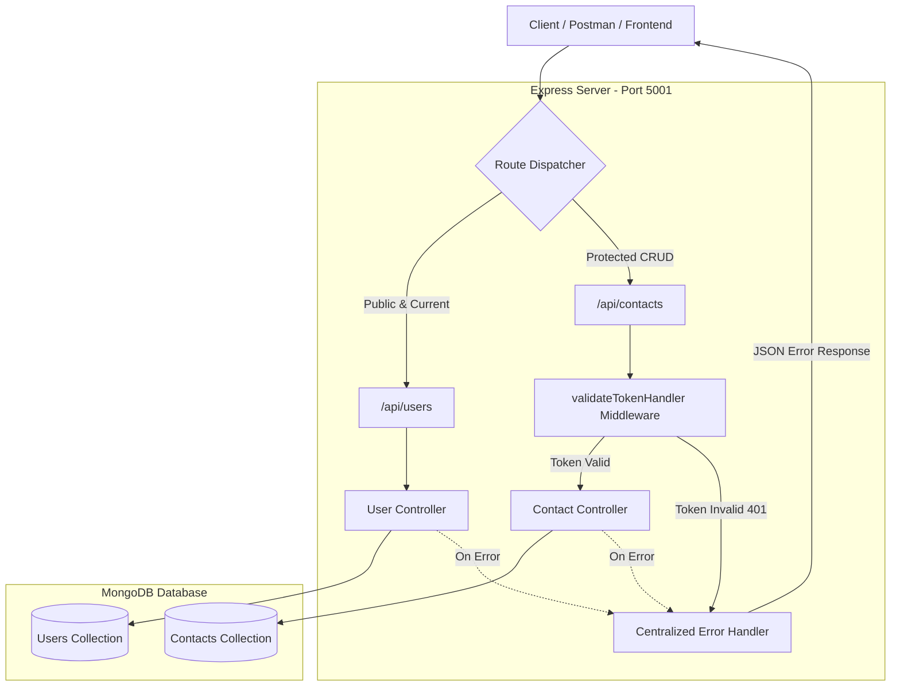

[README.md](https://github.com/user-attachments/files/32471028/README.md)
<div align="center">

# 📇 Contact Manager API

<p align="center">
  <strong>A secure, scalable RESTful API for user authentication and personal contact management built with Node.js, Express, and MongoDB.</strong>
</p>

<p align="center">
  
  
  
  
  
</p>

---

[Key Features](#-key-features) • [Tech Stack](#-tech-stack) • [Architecture](#-architecture) • [Getting Started](#-getting-started) • [API Documentation](#-api-documentation) • [Error Handling](#-error-handling) • [Project Structure](#-project-structure)

---

</div>

<br/>

## ⚡ Key Features

- 🔐 **Secure JWT Authentication**: Stateless user login and registration powered by JSON Web Tokens with 15-minute token expiration.
- 🛡️ **Bcrypt Password Encryption**: User passwords hashed with bcrypt (salt rounds: 10) before persisting into MongoDB.
- 👤 **Data Isolation & Ownership**: Strict authorization guards — users can only view, create, edit, or delete their own contacts.
- 🚦 **Centralized Error Handling**: Standardized error responses with appropriate HTTP status codes (400, 401, 403, 404, 500).
- ⚡ **Async Handler Integration**: Clean asynchronous controller code without tedious try-catch boilerplate using `express-async-handler`.
- 🗄️ **MongoDB & Mongoose ODM**: Fully typed schemas with validation constraints and relational references.

<br/>

---

## 🛠 Tech Stack

| Component | Technology | Purpose |
| :--- | :--- | :--- |
| **Runtime** | `Node.js` | Backend JavaScript runtime |
| **Framework** | `Express 5.x` | RESTful API server routing & middleware |
| **Database** | `MongoDB` | NoSQL document database |
| **ODM** | `Mongoose 9.x` | Schema-based data modeling and DB connection |
| **Authentication** | `jsonwebtoken` | Bearer token creation and validation |
| **Security** | `bcrypt` | Secure salt hashing for passwords |
| **Configuration** | `dotenv` | Environment variable management |
| **Dev Engine** | `nodemon` | Hot reload development server |

<br/>

---

## 🏗 Architecture & Flow



<br/>

---

## 🚀 Getting Started

### Prerequisites

Ensure you have the following installed on your machine:
- [Node.js](https://nodejs.org/) (v16 or later recommended)
- [MongoDB](https://www.mongodb.com/) (Local instance or MongoDB Atlas URI)
- [Git](https://git-scm.com/)

### 1. Clone the Repository

```bash
git clone https://github.com/senmith-01/contactManagerAPI.git
cd contactManagerAPI/backEnd
```

### 2. Install Dependencies

```bash
npm install
```

### 3. Setup Environment Variables

Create a `.env` file in the `backEnd/` directory:

```env
PORT=5001
CONNECTION_STRING=mongodb://localhost:27017/contact-manager
ACCESS_TOKEN_SECRET=your_super_secret_jwt_key
NODE_ENV=development
```

> [!TIP]
> Replace `CONNECTION_STRING` with your MongoDB connection string (local or MongoDB Atlas connection URI).

### 4. Run the Server

#### Development Mode (with automatic restart)
```bash
npm run dev
```

#### Production Mode
```bash
npm start
```

The server will start listening at `http://localhost:5001`.

<br/>

---

## 📖 API Documentation

### Base URL
```
http://localhost:5001/api
```

> [!IMPORTANT]
> All `/api/contacts` endpoints and `/api/users/current` require the `Authorization` header:
> ```http
> Authorization: Bearer <your_access_token>
> ```

<br/>

### 👥 User Endpoints

| Method | Endpoint | Access | Description |
| :---: | :--- | :---: | :--- |
|  | `/api/users/register` | `Public` | Register a new user account |
|  | `/api/users/login` | `Public` | Login and receive a JWT access token |
|  | `/api/users/current` | `Private` | Retrieve current authenticated user profile |

<details>
<summary><strong>🔍 Click to expand User Request & Response Samples</strong></summary>

<br/>

#### 1. Register User
- **URL**: `POST /api/users/register`
- **Request Body**:
```json
{
  "username": "john_doe",
  "email": "john@example.com",
  "password": "SecurePassword123"
}
```
- **Response** (`201 Created`):
```json
{
  "_id": "660c8859a1e0b573a9f0e1a2",
  "email": "john@example.com"
}
```

#### 2. Login User
- **URL**: `POST /api/users/login`
- **Request Body**:
```json
{
  "email": "john@example.com",
  "password": "SecurePassword123"
}
```
- **Response** (`200 OK`):
```json
{
  "accessToken": "eyJhbGciOiJIUzI1NiIsInR5cCI6IkpXVCJ9..."
}
```

#### 3. Current User Profile
- **URL**: `GET /api/users/current`
- **Headers**: `Authorization: Bearer <accessToken>`
- **Response** (`200 OK`):
```json
{
  "username": "john_doe",
  "email": "john@example.com",
  "id": "660c8859a1e0b573a9f0e1a2"
}
```

</details>

<br/>

### 📇 Contact Endpoints

| Method | Endpoint | Access | Description |
| :---: | :--- | :---: | :--- |
|  | `/api/contacts` | `Private` | Retrieve all contacts for the logged-in user |
|  | `/api/contacts` | `Private` | Create a new contact |
|  | `/api/contacts/:id` | `Private` | Fetch a single contact by ID |
|  | `/api/contacts/:id` | `Private` | Update an existing contact (owner only) |
|  | `/api/contacts/:id` | `Private` | Delete a contact (owner only) |

<details>
<summary><strong>🔍 Click to expand Contact Request & Response Samples</strong></summary>

<br/>

#### 1. Create Contact
- **URL**: `POST /api/contacts`
- **Headers**: `Authorization: Bearer <accessToken>`
- **Request Body**:
```json
{
  "name": "Sarah Connor",
  "email": "sarah@example.com",
  "phone": "+1 555-0199"
}
```
- **Response** (`201 Created`):
```json
{
  "_id": "660c897ca1e0b573a9f0e1a5",
  "user_id": "660c8859a1e0b573a9f0e1a2",
  "name": "Sarah Connor",
  "email": "sarah@example.com",
  "phone": "+1 555-0199",
  "createdAt": "2026-09-21T12:00:00.000Z",
  "updatedAt": "2026-09-21T12:00:00.000Z"
}
```

#### 2. Get All Contacts
- **URL**: `GET /api/contacts`
- **Headers**: `Authorization: Bearer <accessToken>`
- **Response** (`200 OK`):
```json
[
  {
    "_id": "660c897ca1e0b573a9f0e1a5",
    "user_id": "660c8859a1e0b573a9f0e1a2",
    "name": "Sarah Connor",
    "email": "sarah@example.com",
    "phone": "+1 555-0199",
    "createdAt": "2026-09-21T12:00:00.000Z",
    "updatedAt": "2026-09-21T12:00:00.000Z"
  }
]
```

#### 3. Update Contact
- **URL**: `PUT /api/contacts/:id`
- **Headers**: `Authorization: Bearer <accessToken>`
- **Request Body**:
```json
{
  "name": "Sarah Connor-Reese",
  "phone": "+1 555-0200"
}
```
- **Response** (`200 OK`):
```json
{
  "_id": "660c897ca1e0b573a9f0e1a5",
  "user_id": "660c8859a1e0b573a9f0e1a2",
  "name": "Sarah Connor-Reese",
  "email": "sarah@example.com",
  "phone": "+1 555-0200",
  "updatedAt": "2026-09-21T12:05:00.000Z"
}
```

#### 4. Delete Contact
- **URL**: `DELETE /api/contacts/:id`
- **Headers**: `Authorization: Bearer <accessToken>`
- **Response** (`200 OK`):
```json
{
  "_id": "660c897ca1e0b573a9f0e1a5",
  "user_id": "660c8859a1e0b573a9f0e1a2",
  "name": "Sarah Connor-Reese",
  "email": "sarah@example.com",
  "phone": "+1 555-0200"
}
```

</details>

<br/>

---

## 🚨 Error Handling

The application uses a centralized error-handling middleware that intercepts thrown errors and converts them to standard JSON formats:

| HTTP Status | Error Title | Scenario |
| :---: | :--- | :--- |
| `400` | **Validation Failed** | Missing required fields (`name`, `email`, `phone`, `password`, etc.) or user already exists |
| `401` | **Unauthorized** | Missing, malformed, or expired JWT bearer token / Invalid credentials |
| `403` | **Forbidden** | User attempting to update or delete a contact belonging to someone else |
| `404` | **Not Found** | Requested contact ID does not exist in the database |
| `500` | **Server Error** | Unhandled internal server or database exception |

#### Standard Error Response Format:
```json
{
  "title": "Validation Failed",
  "message": "All fields are mandatory!",
  "stack": "Error: All fields are mandatory! at ..."
}
```
*(Note: `stack` trace is automatically suppressed when `NODE_ENV=production`)*

<br/>

---

## 📂 Project Structure

```bash
backEnd/
├── config/
│   └── dbConnection.js         # MongoDB connection setup using Mongoose
├── constants.js                # HTTP status code definitions
├── controller/
│   ├── contactController.js    # Contact CRUD operations & access control
│   └── userController.js       # User registration, login & profile logic
├── middleware/
│   ├── errorHandler.js         # Centralized error response formatter
│   └── validateTokenHandler.js # JWT verification & user context injector
├── models/
│   ├── contactModel.js         # Contact schema with User relation
│   └── userModel.js            # User schema with unique email constraint
├── routes/
│   ├── contactRoutes.js        # Contact routing & middleware attachment
│   └── userRoutes.js           # User authentication routes
├── .env                        # Environment configurations (ignored in git)
├── .gitignore                  # Git ignore rules
├── package.json                # Project dependencies and npm scripts
├── README.md                   # Project documentation
└── server.js                   # Application entry point & Express server
```

<br/>

---

## 🔒 Security Best Practices Implemented

- **Password Hashing**: Passwords are never stored in plain text — bcrypt generates salted hashes.
- **JWT Protection**: Private endpoints require verification using a secret key.
- **Owner Verification**: Users cannot view, modify, or delete contacts owned by other users (`contact.user_id === req.user.id`).
- **Environment Isolation**: Sensitive configuration (Database connection string, JWT secrets, Ports) are loaded securely via `.env`.

<br/>

---

## 👨‍💻 Author

**Ranida Samaranayake**
- GitHub: [@senmith-01](https://github.com/senmith-01)

<br/>

<div align="center">
  <sub>Built with ❤️ using Express.js & MongoDB</sub>
</div>
